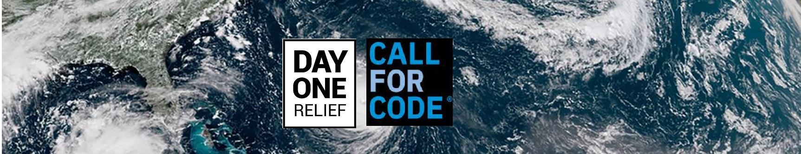
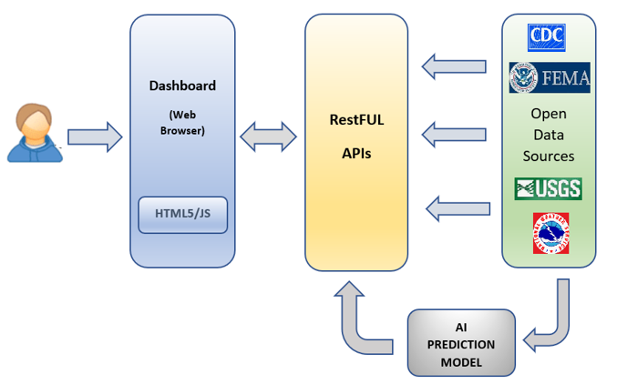
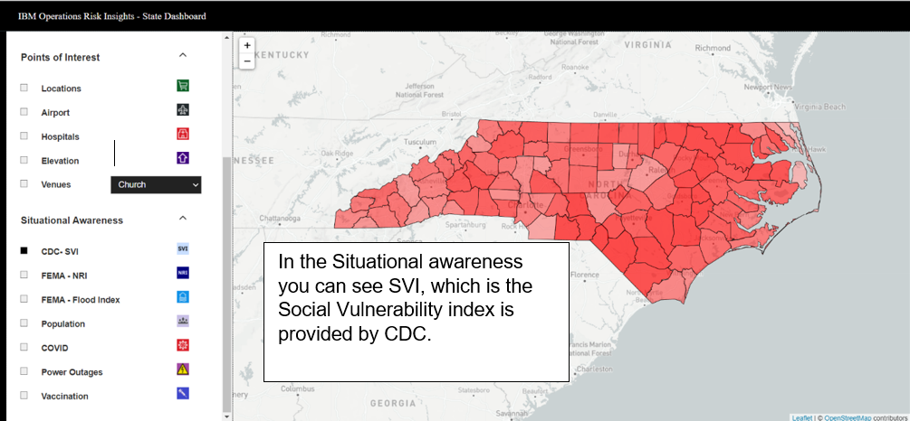
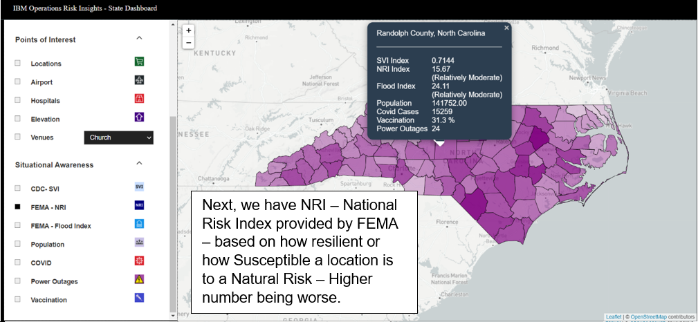
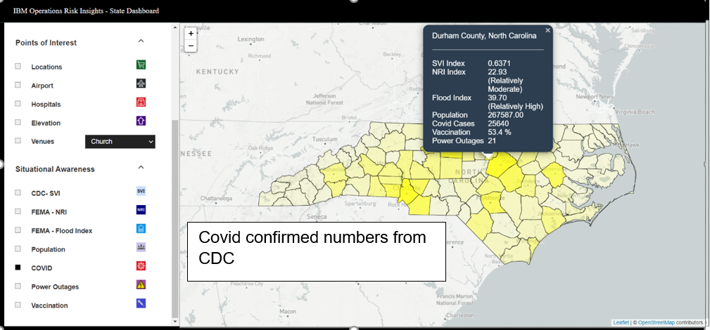
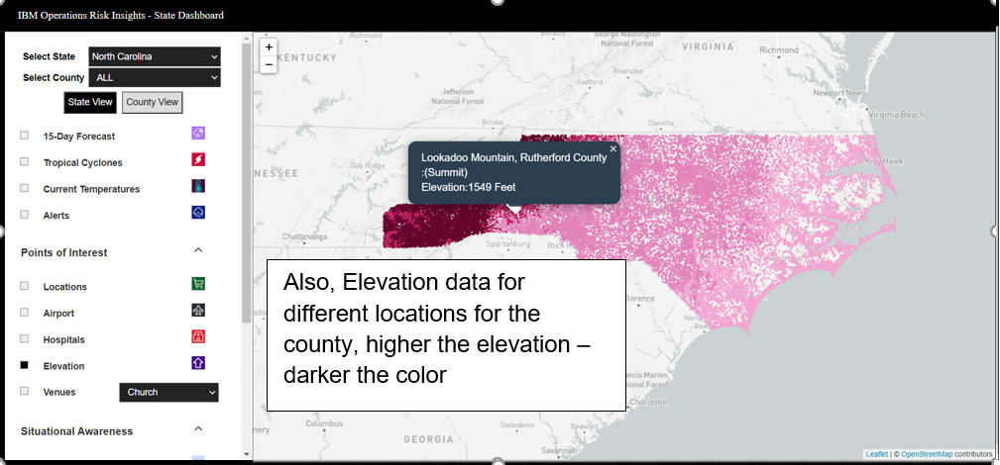
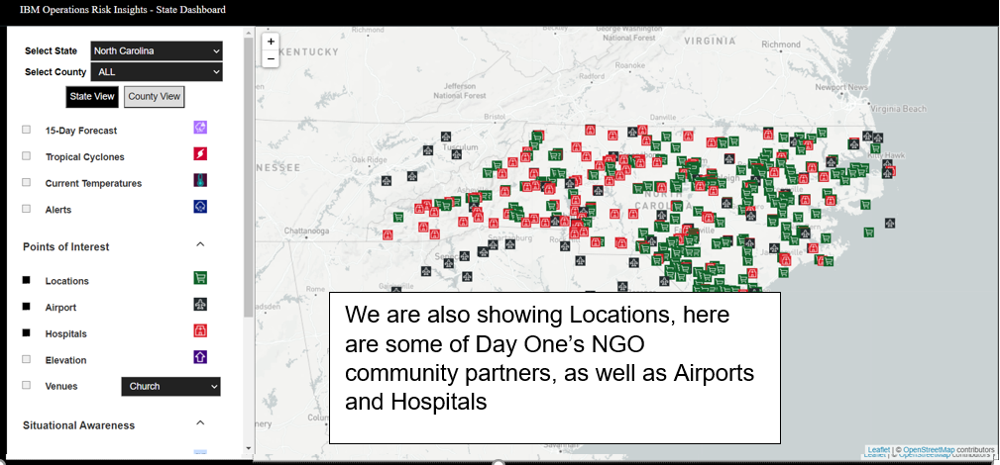
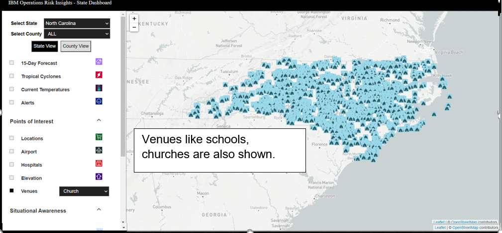
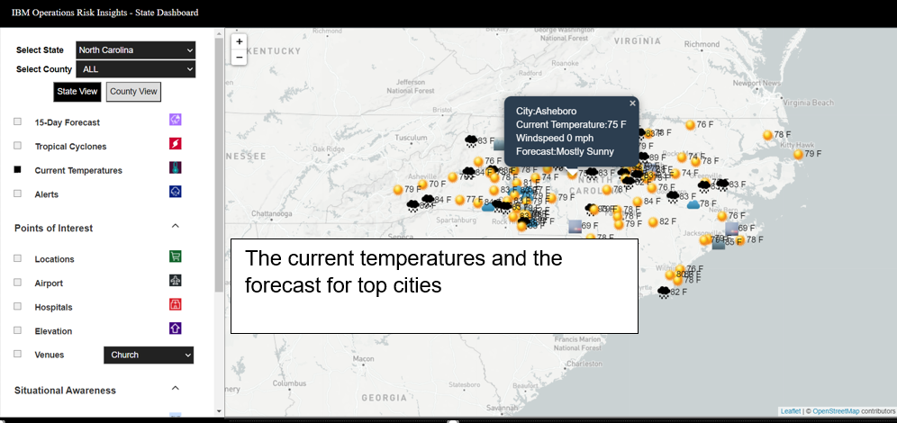

# Day One Relief - Call For Code
### Risk Analysis, Prediction and Preparedness for Disaster Relief

### Day One Relief - Supporting community resiliency through all stages of disaster
 

Through strong community relationships, Day One Relief serves disaster-impacted populations. Since each disaster is unique, a relief solution that is predictable, repeatable and systematic in nature has been identified as what’s needed to make an improved impact.

Day One Relief was founded in September 2018, during Hurricane Florence, in order to rapidly source and deliver supplies via air and road to those affected by the storm. Our formation came as a result of our efforts spearheading the rapid response at the TAC AIR terminal at RDU. We brought together volunteer pilots and NGOs who have been on the ground in eastern NC, some for 45+ years. We raised the supply and engaged the community, resulting in 1500 volunteers throughout the week.

We are working on creating racial equity in the vaccine rollout. We are phonebanking, canvassing, and helping organize vaccine clinics with vaccine providers, HBCUs and DHHS.

## Contents

- [Risk Analysis, Prediction and Preparedness for Disaster Relief](#project-name) 
  - [Short description](#short-description)
    - [What's the problem?](#whats-the-problem)
    - [How can technology help?](#how-can-technology-help)
    - [The idea](#the-idea)
  - [IBM Services Used](#iBM-services-used)
  - [Open Data Sources used](#open-data-sources-used)
  - [The architecture](#the-architecture)
  - [Long description](#long-description)
  	- [Web Based Dashboard](#web-based-dashboard)
    - [Jupyter Notebook Analysis?](#jupyter-notebook-analysis)  
  - [Demo video](#demo-video) 
  - [Project roadmap](#project-roadmap)
  - [Getting started](#getting-started)
  - [Built with](#built-with)
  - [Authors](#authors)
  - [License](#license)
  - [Acknowledgments](#acknowledgments)
  

# Risk Analysis, Prediction and Preparedness for Disaster Relief
 

## Short description

### What's the problem?

Whether it’s a hurricane, or Pandemic relief or a building collapse, The best first responders are the local NGOS, these organizations know their environments and people best. NGOs are the “go-to” entities in disaster response and recovery because of their real  insight on the needs, and sociocultural complexities of their neighborhoods.

Day One Relief goes wherever the gaps are, and recently that has been the supply chain for the COVID-19 response. It has secured and delivered gowns, booties and masks to federal prisons, emergency departments in hospitals, farmworker camps—wherever the need was greatest.

For Day One Relief and its partner NGOs, toughest challenge, however, might be coming up. COVID-19 is surging in the South. And this year’s hurricane season, which started in June and continues through November, is predicted to be harsher than usual. How do you not only keep people safe after their homes have been destroyed, but also keep them socially distant? And how do you keep your volunteers safe when they enter coronavirus hotspots?

### How can technology help?

Fatalities and injuries from natural disasters can be reduced if the disaster can be predicted and advance warning given to people in the danger zone. 
In recent times, technology has been employed to fast track disaster relief efforts.Awareness, education, preparedness, and prediction and warning systems can reduce the disruptive impacts of a natural disaster on communities.

### The idea

A web based dashboard which show all data points, forecasts, power outages - everything is in one place, constantly updating, so that decisions can be made faster and smarter. Other disaster relief groups can customize this platform to better understand their respective geographical regions by tracking weather patterns, COVID-19 cases and locations of the poorest, most vulnerable people, as well as sites of hospitals, airports, private airstrips and warehouses.

## IBM services used

<ol>
<li>IBM Cloud for Web-App Deploy</li>

<li>IBM Cloud PAK For Data
<ul>
<li>Watson Studio - Jupitor Notebook for prediction Analysis</li>
<li>Auto-AI for analyzes Weather forecast Data and generating candidate machine learning models </li>
</ul>
</li> 

<li>The Weather Company (TWC) Apis for Storm/Hurricane Forecasts</li>
</ol>
 
 
## Open data sources used
<ul><li><a href="https://www.atsdr.cdc.gov/placeandhealth/svi/index.html">CDC/ATSDR Social Vulnerability Index</a></li></ul>
<ul><li><a href="https://www.fema.gov/flood-maps/products-tools/national-risk-index">FEMA National Risk Index for Natural Hazards & Flood Index</a></li></ul> 
<ul><li><a href="https://api.weather.gov/alerts/active?area=NC">NWS - Current Alerts For North Carolina</a></li> </ul>
<ul><li><a href="https://api.weather.gov/alerts">NWS - Current Temperatures & Forecast for North Carolina Cities</a></li> </ul>
<ul><li><a href="https://www.usgs.gov/core-science-systems/national-geospatial-program/national-map">USGS - Elevation Data for North Carolina</a></li> </ul>
<ul><li><a href="https://data.cdc.gov/resource/8xkx-amqh.json?recip_state=NC">Vaccination Data from CDC for North Carolina</a></li> </ul>
<ul><li><a href="https://developer.foursquare.com/docs/places-api">Four-Square APIs for North Carolina Venues</a></li></ul>

## The architecture

## Long description

### Day One Relief - Call for Code submission contains below projects 

1.	A Interactive Web Based Dashboard of North Carolina
2.	Jupyter Notebook based prediction - Predict which NC counties will be most at risk from a Hurricane or Tropical Storm 

### Web Based Dashboard

Success of disaster preparedness in sometime depends more on effective local response. With that in mind, we created a State/County Dashboard For North Carolina. User can select a county, and- the dashboard will be customized for that selection.
State view will have the ability to select all alerts for the state, points of interest, and various indexes by county. 
County view will provide all indexes and alerts, as well as relevant information like population and population density. In addition, users can select venues such as parks and schools.
 
Currently we have only North Carolina and its counties enabled but we are in the process of adding other states, starting with Florida, Texas.

In the Situational awareness you can see SVI. Social vulnerability refers to the potential negative effects on communities caused by external stresses on human health. Such stresses include natural or human-caused disasters, or disease outbreaks. Reducing social vulnerability can decrease both human suffering and economic loss. The <a href="https://www.atsdr.cdc.gov/placeandhealth/svi/index.html">CDC/ATSDR Social Vulnerability Index (CDC/ATSDR SVI)</a> uses 15 U.S. census variables to help local officials identify communities that may need support before, during, or after disasters

FEMA calculated NRI - The National Risk Index  to help illustrate the nation’s communities most at risk of natural hazards. It is made possible through a collaboration between FEMA and dozens of partners in academia; local, state and federal government; and private industry.  The Index leverages best available source data to provide a holistic view of community-level risk nationwide by combining multiple hazards with socioeconomic and built environment factors. It calculates a baseline relative risk measurement for each United States county and census tract for 18 natural hazards, based on Expected Annual Loss, Social Vulnerability, and Community Resilience. We are also showing flood index calculated by FEMA based on historic flood loss in that region.

The dashboard also shows shows a heatmap of current Covid Numbers by county, and the percentage of eligible population fully vaccinated - data provided by CDC.

When it comes to Flooding due to heavy rains or storms, elevation of the location plays a major role, so we are also showing elevation data for North Carolina provided by USGS, 

And Critical locations, Venues and current temperatures & daily forecast for top cities for each county.

## Demo video  

## Project roadmap

TO-DO

## Getting started

TO-DO

## Authors

1. Jil Christensen
2. Nikita Nangia
3. Zachary Haugan
4. Isshaan Oren Pilant

## License

This project is licensed under the Apache 2 License - see the [LICENSE](LICENSE) file for details.

## Acknowledgments

- Based on [Billie Thompson's README template](https://gist.github.com/PurpleBooth/109311bb0361f32d87a2).

 
 
  